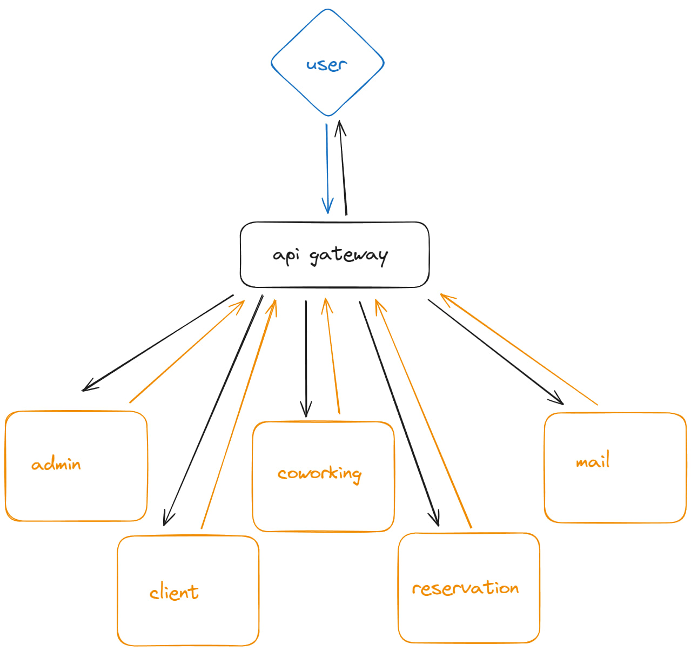

# Бэкэнд

## Тестовые аккаунты:
```
Логин Пароль

admin@tbank.ru 123DSAdk#
testing@tbank.ru VeryH@arDP@ssw0rd!!111
support@tbank.ru IL0v3T3st1ng
```

## Swagger UI
https://prod-team-8-t7nj4g3c.final.prodcontest.ru/swagger-ui

## CI
Сборка через GitLab CI, собираются Docker образы и отправляются на Registry

## CD
Используется [ArgoCD](https://argo-cd.readthedocs.io/en/stable/). Периодически выполняются запросы на Container Registry и Git репозиторий для получения изменений, если они есть, то ArgoCD подтягивает новые версии контейнеров и перезапсукает.

## Архитектура
