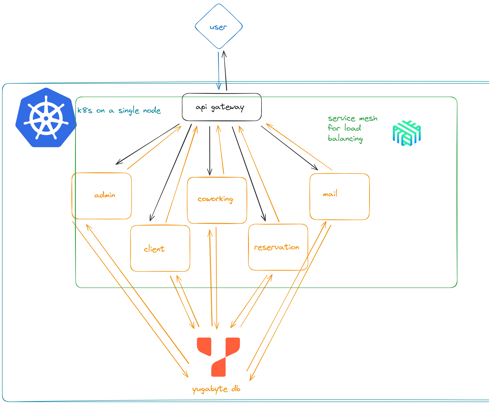

# T-Lounge Backend Documentation

## Overview

Backend repository: [GitLab](https://gitlab.prodcontest.ru/team-8/backend)  

### Stack

- **Rust**, **Go** – main programming languages  
- **gRPC** – service communication  
- **Kubernetes** – container orchestration  
- **YugabyteDB** – distributed SQL database  
- **Linkerd** – service mesh  
- **Grafana**, **Prometheus** – monitoring and observability  
- **Valkey** – in-memory database  
- **MinIO** – object storage  
- **ArgoCD** – continuous delivery  

---

## Documentation

All backend-related documentation can be found [here](https://gitlab.prodcontest.ru/team-8/backend).  

---

## Technical Implementation

- **Backend Repo:** [Click here](https://gitlab.prodcontest.ru/team-8/backend)  
- **Swagger API Docs:** [Click here](https://prod-team-8-t7nj4g3c.final.prodcontest.ru/swagger-ui/)  
- **Grafana Dashboard:** [Click here](https://dash.prod-8.duckdns.org)  
- **Linkerd Dashboard:** [Click here](https://link.prod-8.duckdns.org)  
- **Primary Database:** [Click here](https://db.prod-8.duckdns.org)  
- **Secondary Database:** [Click here](https://db-2.prod-8.duckdns.org)  
- **CI/CD System (ArgoCD):** [Click here](https://argo.prod-8.duckdns.org)  

---

## Architecture  

  

## Services
- Mail - сервис для отправки писем по электронной почте
- Notifications - сервис по уведомлениям, регулирует время отправки (вызывает Mail за 3 часа до записи)
- Reservation - сервис для резервирования места
- Coworking - сервис для управления коворкингом
- Client - сервис для управления клиентами
- Admin - сервис для администрирования
- Images - сервис для хранения и использования изображений


### Service Structure
[Project Structure & Service Design](https://gitlab.prodcontest.ru/team-8/backend)  

### Database Schema
Client schema
  
Reservation schema
  
Reservation schema
  
Admins schema
  
Coworking schema
  


### CI/CD Pipeline

1. Код отправляется на репозиторий на гитлабе.
2. GitLab CI видит изменения и начинает параллельную сборку Docker образов.
3. Когда сборка завершена, образы загружаются на Container Registry.
4. ArgoCD видит новые версии Docker образов с тэгом master и автоматически обновляет манифест k8s и образы.

Latest Pipeline - [clickme](https://gitlab.prodcontest.ru/team-8/backend/-/pipelines/19633)

---

## API & Testing
- **Swagger/OpenAPI Specification:** [Click here](https://prod-team-8-t7nj4g3c.final.prodcontest.ru/swagger-ui/)  
- **Swagger UI Usage Guide:** [Click here](https://gitlab.prodcontest.ru/team-8/backend)  
- **Code Coverage Report:** 0%


## Mock CLients & Admins
[Email] - [Password]

Clients
```
brucebutler@example.com - Kz8py8kCc0
osmith@example.com - brdY5hFmLY
jacobjohnson@example.org - vo5Glp58i07v
vrogers@example.net - mIqJzBfdRRDz
elee@example.com - 0w2S3h47n8
rclark@example.org - HJ4JccPWC
cruzmichael@example.net - gWdergSxMM
jacksonsherri@example.net - KEyFQX1V
jennifer26@example.org - bo1cGcOh6
stefanie84@example.net - IH9YQGsgsSR
```

Admins
```
admin@tbank.ru - 123DSAdk#
testing@tbank.ru - VeryH@arDP@ssw0rd!!111
support@tbank.ru - IL0v3T3st1ng
ygraves@example.net - p*UsoHUK*7
taylorzimmerman@example.com - )hJI%0ThZG
qball@example.org - _k$W1X$ib$
monicajohnson@example.net - 5)2Nbtdq0X
jacqueline31@example.com - (9GNHv$r#U
swhite@example.com - t_21Rq)mKK
derekreed@example.com - 3YPgoNQd$6
```